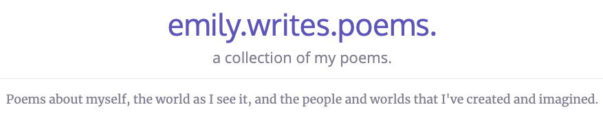

## What's this project?
A webapp displaying the text and details of my poetry.

## The technical stuff
* The MERN stack:
    * M: MongoDB (set up and populated with poems!)
    * E: Express.js (backend routing)
    * R: React (bootstrapped with [Create React App](https://github.com/facebook/create-react-app))
    * N: Node.js (also with Create React App)
* I am using Python (with PyMongo) scripts for updating the database of poems. More on that in [this repo](https://www.github.com/emily-writes-poems/emily-writes-poems-scripts).
* I am also creating a GUI program that uses the Python scripts. It's written with Swift. See more in [this repo](https://www.github.com/emily-writes-poems/emily-writes-poems-processing).
* The webapp is hosted on Heroku, so there may a ~30 second delay in fetching the site initially.
