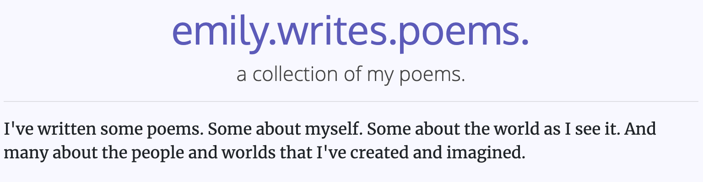

## What's this project?

## The technical stuff
* The MERN stack:
    * M: MongoDB [set up and populated with poems!]
    * E: Express.js [backend routing]
    * R: React [Bootstrapped with [Create React App](https://github.com/facebook/create-react-app)]
    * N: Node.js [Also with Create React App]
* I am using Python (with PyMongo) scripts for updating the database of poems.
